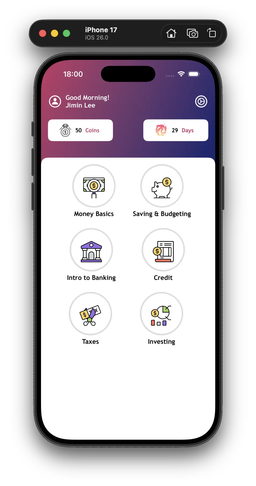

# Equidex (Redux)

An experimental SwiftUI iOS app designed to teach kids (and beginners) the foundations of personal finance in a fun, Duolingo‑inspired way. Learners progress through bite‑sized modules (Money Basics, Saving & Budgeting, Banking, Credit, Taxes, and Investing) while earning coins, tracking streaks/days, and taking quick quizzes.

Educational purpose only — not financial advice.



## Features
* SwiftUI home screen with gradient header and module icons
* Basic module/lesson paging prototype
* Quiz screen with simple correct / incorrect alerts
* Reusable view components (module circles, counters, gradient, quiz answer rows)

## How to run
1. Open the Xcode project.
2. Use iOS 17 (or later) simulator.
3. Run the app (⌘R). That’s it—no external dependencies.

CLI build (optional):
```bash
xcodebuild -scheme equidex-redux -destination 'platform=iOS Simulator,name=iPhone 15'
```

